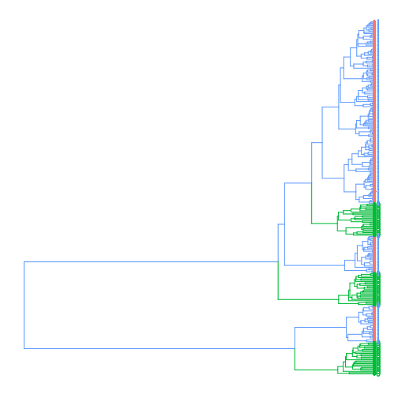
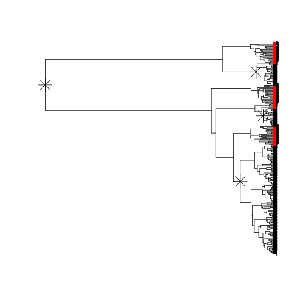

# `treestructure`

## Citation

E.M. Volz, Wiuf, C., Grad, Y., Frost, S., Dennis, A., Didelot, X.D. (2020) Identification of hidden population structure in time-scaled phylogenies. Systematic Biology. https://doi.org/10.1101/704528 

## Installation

To install latest development version, first install the `devtools` package and then from your R console run: 

```r
devtools::install_github( 'emvolz-phylodynamics/treestructure' )
```

Alternatively, download this repository and [follow instructions for your OS on installing packages from source](https://cran.r-project.org/doc/manuals/r-release/R-admin.html#Installing-packages).

A command-line interface is available. See inst/tscl. 

## Quick start 

This example shows `trestruct` applied to a simulated structured coalescent tree that includes samples from a large constant size population and samples from three small 'outbreaks' which are growing exponentially. 

```r
library(treestructure)
```

```
## Loading required package: ape
```

```r
( tree <- read.tree( system.file('sim.nwk', package='treestructure') ) ) 
```

```
## 
## Phylogenetic tree with 275 tips and 274 internal nodes.
## 
## Tip labels:
## 	1, 1, 1, 1, 1, 1, ...
## 
## Rooted; includes branch lengths.
```

```r
s <- trestruct( tree ) 
```

```
## Finding splits under nodes: 276 
## Finding splits under nodes: 276 280 
## Finding splits under nodes: 276 447 
## Finding splits under nodes: 276 498
```

You can print the results: 

```r
print(s) 
```

```
## Call: 
## trestruct(tre = tree)
## 
## Number of clusters: 4 
## Number of partitions: 2 
## Significance level: 0.01 
## Cluster and partition assignment: 
##    taxon cluster partition
## 1      1       1         1
## 2      1       1         1
## 3      1       1         1
## 4      1       1         1
## 5      1       1         1
## 6      1       1         1
## 7      1       1         1
## 8      1       1         1
## 9      1       1         1
## 10     1       1         1
## ...
## For complete data, use `as.data.frame(...)` 
## 
```

The default plotting behavior uses the `ggtree` package if available. 

```r
plot(s)  + ggtree::geom_tiplab() 
```




If not, or if desired, `ape` plots are available

```r
plot( s, use_ggtree = FALSE )
```


