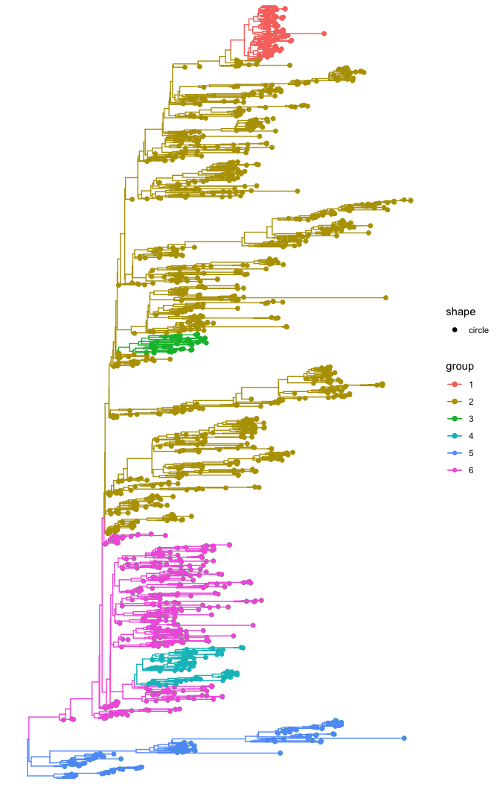
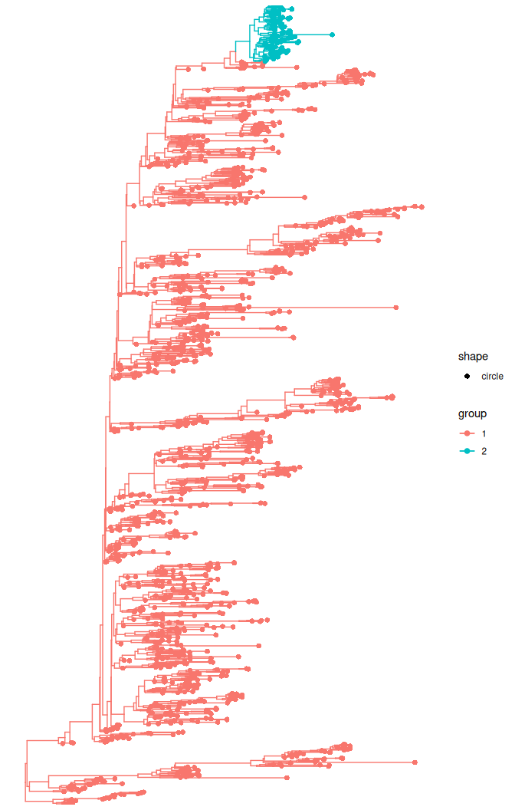

# Node support values using treestructure

## Introductions

This tutorial uses the public data available for Ebola
[here](https://github.com/ebov/space-time) to demonstrate the use of
node support values (e.g. bootstrap and posterior probability) to avoid
designating population structure in badly supported clades.

We will use their [time-scaled phylogenetic
tree](https://github.com/ebov/space-time/blob/master/Data/Makona_1610_cds_ig.GLM.MCC.tree)
estimated with [BEAST](https://beast.community).

First, we need to load the R package we will use in this tutorial.

``` r
library(treeio)
library(ggtree)
library(treestructure)
```

Now, we will load the time-scaled phylogenetic tree with posterior
probability support values:

``` r
#get the dated tree by first downloading it from the URL below
tree_url <- "https://raw.githubusercontent.com/ebov/space-time/master/Data/Makona_1610_cds_ig.GLM.MCC.tree"
tmp_file <- tempfile(fileext = ".tree")

#Download BEAST tree to a tmp file
download.file(tree_url, tmp_file, mode = "wb")

#read the downloaded tree
beast_tree <- read.beast(tmp_file)
```

Then we need to convert the tree to a `phylo` object and add the
posterior probability information from the Bayesian tree to the `phylo`
object tree.

If we use the `ape:read.nexus` to read the tree that was estimated with
BEAST, we won’t get the posterior probability associated to the clades.

We now convert the dated tree to `phylo` object.

``` r
dated_tre <- as.phylo(beast_tree)
```

Now we add the posterior probability from the BEAST tree to the
dated_tree object.

``` r
# Get number of tips
n_tips <- length(dated_tre$tip.label)

# Get BEAST tree as tibble (it will include node numbers and posterior probabilities)
tree_data <- as_tibble(beast_tree)

#get posterior probability
posterior <- as.numeric(tree_data$posterior[(n_tips + 1):nrow(tree_data)])

#add the posterior probability information to the `phylo` object
dated_tre$node.label <- posterior
```

### Assign clusters without using node support

Firstly, we will assign clusters without using node support values. Note
that the parameter `nodeSupportValues` is set to FALSE.

``` r
trestruct_res_nobt <- trestruct(dated_tre, 
                                minCladeSize = 30, 
                                nodeSupportValues = FALSE, 
                                level = 0.01)
```

In the above example, the `trestruct` function took 7 minutes to run on
a macOS M2. Here, we can load the results instead.

``` r
trestruct_res_nobt <- readRDS( system.file('trestruct_res_nobt.rds',
                                           package='treestructure') )

plot(trestruct_res_nobt, use_ggtree = T) + ggtree::geom_tippoint()
```


The `treestructure` analyses resulted in 23 clusters.

### Assign clusters using branch support

Now, we will assign clusters using the information on branch support. As
we are analyzing a dated tree estimated with BEAST, the branch support
is the posterior probability.

We designate clusters that have at least 0.95 posterior probability.
This is achieved by setting to 95 the parameter *nodeSupportThreshold*
in the **trestruct** function.

Note that now the parameter `nodeSupportValues` is set to TRUE, which
tells the algorithm that the node support values is provided with the
`phylo` object as `node.label`.

You can also provide the `nodeSupportValues` as a vector with length
equal to the number of internal nodes in the tree.

``` r
trestruct_res <- trestruct(dated_tre, 
                           minCladeSize = 30, 
                           nodeSupportValues = TRUE, 
                           nodeSupportThreshold = 95, 
                           level = 0.01)
```

In the above example, the `trestruct` function took 50 seconds to run on
a macOS M2. Here, we can load the results instead.

``` r
trestruct_res <- readRDS( system.file('trestruct_res.rds',
                                      package='treestructure') )

plot(trestruct_res, use_ggtree = T) + ggtree::geom_tippoint()
```



Now we have only 6 well-supported clusters with differences in
coalescent patterns.

Note that this might change if you use a higher or lower value for the
*nodeSupportThreshold* in the **trestruct** function.

### Using the CH-index

The CH-index will compare different values for the parameter `levels` in
the `treestructure` algorithm. We will need to specify `level` = NULL
and specify the lower and upper bound to optimize the parameter `level`.

Note that we will also take into consideration the use of branch
support.

``` r
trestruct_chindex <- trestruct(dated_tre,
                               minCladeSize = 30, 
                               nodeSupportValues = TRUE, 
                               nodeSupportThreshold = 95,
                               level = NULL,
                               levellb = 0.0001, 
                               levelub = 0.001)
```

In the above example, the `trestruct` function took 5 minutes to run on
a macOS M2. Here, we can load the results instead.

``` r
trestruct_chindex <- readRDS( system.file('trestruct_chindex.rds',
                                      package='treestructure') )

plot(trestruct_chindex, use_ggtree = T) + ggtree::geom_tippoint()
```



Now we have only 2 well-supported clusters with differences in
coalescent patterns after optimizing the significance level.

In this example, instead of using level = 0.01 (as in the default ), the
optimization of level by using the CH-index identified level as 0.00073.

#### Final considerations

The function `trestruct` has a parameter named `nsim` that refers to the
number of simulations for computing the null distribution of the test
statistics (Volz et al. 2020).

The `nsim` parameter in the `trestruct` function is is set to the
default value of 10,000, which is a good value if the level parameter is
set to 0.01 (which is the default value).

If decreasing the value of the level parameter, the value of `nsim`
should be increased. In the above example using CH-index, the algorithm
identified a significance level of 0.00073. However, the analyses were
carried out using the default `nsim` of 10,000 simulations. We have
future plans to automatically detect the adequate number of simulations
(`nsim` value) given the sizes of clades being compared and the
threshold p-value used in the test.

As treestructure is implemented in the moment, you should run a
sensitive analyses on your own dataset, if you use a significance level
smaller than 0.01. For example, if you use a significance `level` of
0.001 and a `nsim` \> 10,000, then you can run your analysis twice and
compare the results obtained in both runs, which should be very similar.
If results are very different, you should increase the value of `nsim`.

## References

Volz, EM, W Carsten, YH Grad, SDW Frost, AM Dennis, and X Didelot. 2020.
“Identification of Hidden Population Structure in Time-Scaled
Phylogenies.” *Systematic Biology* 69: 884–96.
<https://doi.org/10.1093/sysbio/syaa009>.
