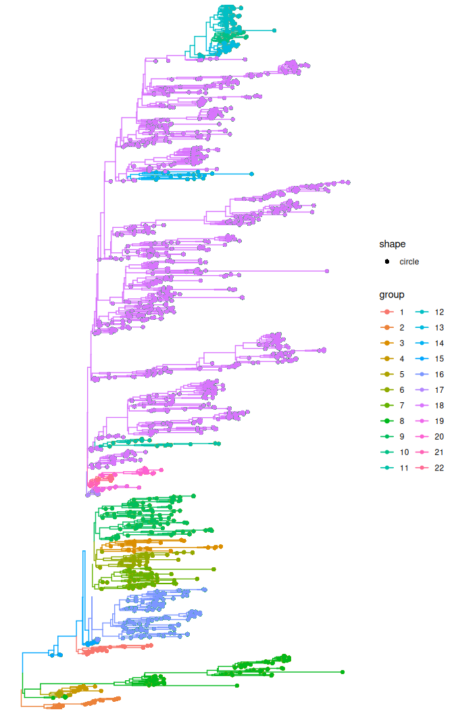
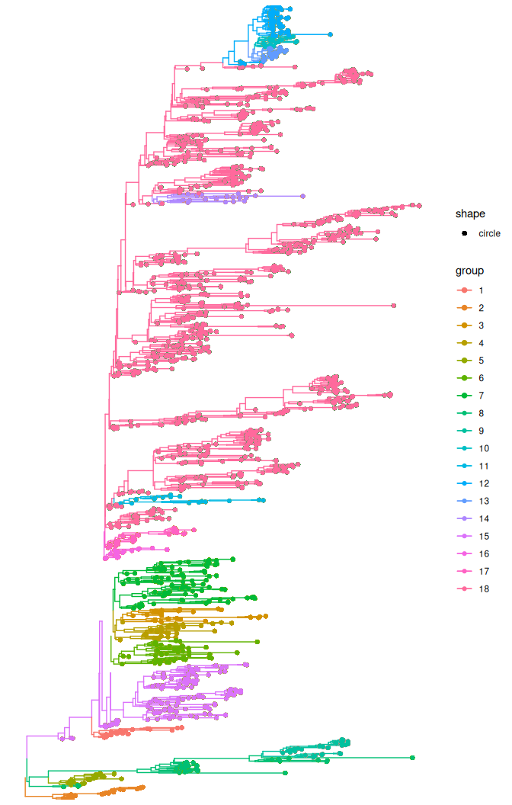
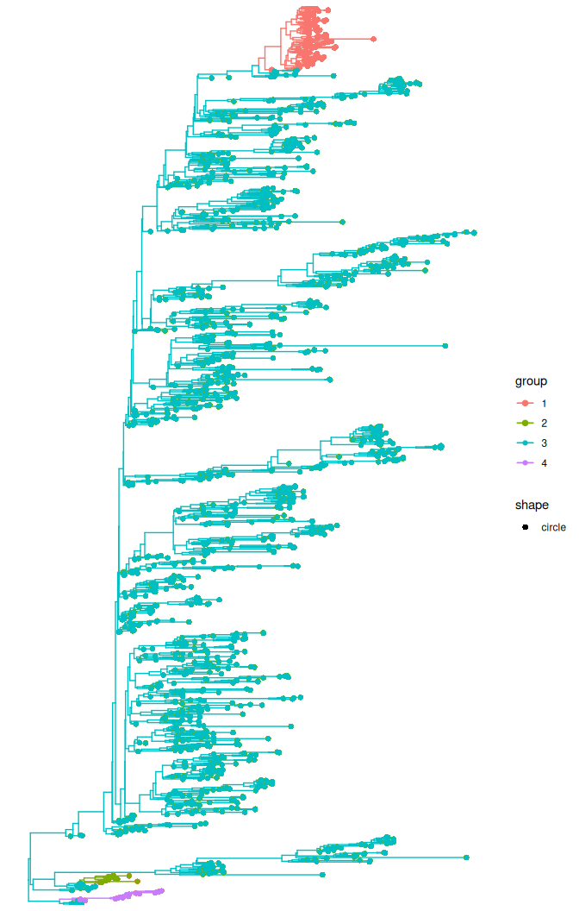
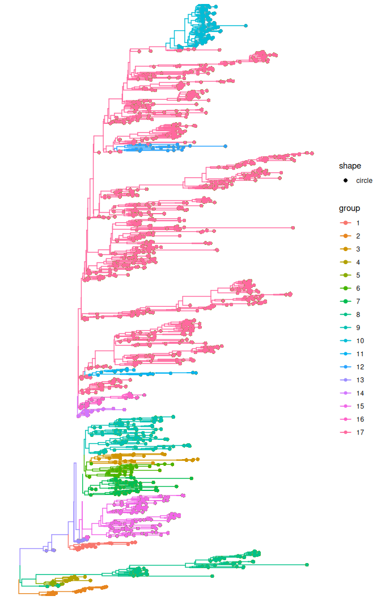

# Node support values using treestructure (v2)

## Introduction

This tutorial uses the public data available for Ebola
[here](https://github.com/ebov/space-time) to demonstrate the use of
node support values (e.g. bootstrap and posterior probability) to avoid
designating population structure in badly supported clades.

We will use their [time-scaled phylogenetic
tree](https://github.com/ebov/space-time/blob/master/Data/Makona_1610_cds_ig.GLM.MCC.tree)
estimated with [BEAST](https://beast.community).

Throughout we use the default analysis, in which the split threshold is
calibrated to a target false discovery rate (`fdr = 0.2`), with
`minCladeSize = 10`.

First, we need to load the R package we will use in this tutorial.

``` r

library(treeio)
library(ggtree)
library(treestructure)
```

Now, we will load the time-scaled phylogenetic tree with posterior
probability support values:

``` r

#get the dated tree by first downloading it from the URL below
tree_url <- "https://raw.githubusercontent.com/ebov/space-time/master/Data/Makona_1610_cds_ig.GLM.MCC.tree"
tmp_file <- tempfile(fileext = ".tree")

#Download BEAST tree to a tmp file
download.file(tree_url, tmp_file, mode = "wb")

#read the downloaded tree
beast_tree <- read.beast(tmp_file)
```

Then we need to convert the tree to a `phylo` object and add the
posterior probability information from the Bayesian tree to the `phylo`
object tree.

If we use the `ape:read.nexus` to read the tree that was estimated with
BEAST, we won’t get the posterior probability associated to the clades.

We now convert the dated tree to `phylo` object.

``` r

dated_tre <- as.phylo(beast_tree)
```

Now we add the posterior probability from the BEAST tree to the
dated_tree object.

``` r

# Get number of tips
n_tips <- length(dated_tre$tip.label)

# Get BEAST tree as tibble (it will include node numbers and posterior probabilities)
tree_data <- as_tibble(beast_tree)

#get posterior probability
posterior <- as.numeric(tree_data$posterior[(n_tips + 1):nrow(tree_data)])

#add the posterior probability information to the `phylo` object
dated_tre$node.label <- posterior
```

### Assign clusters without using node support

Firstly, we will assign clusters without using node support values. Note
that the parameter `nodeSupportValues` is set to FALSE.

``` r

trestruct_res_nobt <- trestruct(dated_tre,
                                fdr = 0.2,
                                minCladeSize = 10,
                                nodeSupportValues = FALSE)
```

Here, we load the precomputed result.

``` r

trestruct_res_nobt <- readRDS( system.file('trestruct_res_nobt.rds',
                                           package='treestructure') )

plot(trestruct_res_nobt, use_ggtree = T) + ggtree::geom_tippoint()
```



The `treestructure` analysis resulted in 22 clusters.

Although `treestructure` uses only the shape of the tree, the clusters
largely correspond to country. The tip labels encode the sampling
country (Guinea, Sierra Leone or Liberia):

``` r

country <- sapply(strsplit(trestruct_res_nobt$tree$tip.label, "\\|"), `[`, 4)
country[!country %in% c("SLE", "LBR", "GIN")] <- "other"
table(cluster = trestruct_res_nobt$clustering, country = country)
#>        country
#> cluster GIN LBR other SLE
#>      1    8   4     0   9
#>      2   24   0     1   0
#>      3    0  26     0   1
#>      4   14   0     0   0
#>      5    9   1     0   0
#>      6    7  30     0   0
#>      7    2  47     0   0
#>      8   69   0     0   4
#>      9   41  60     0   0
#>      10   0   0     0  22
#>      11   1   0     0  19
#>      12   0   0     0  70
#>      13   0   0     0  29
#>      14   1   0     0  18
#>      15   3   0     0  11
#>      16  71  41     1   4
#>      17   0   0     0  10
#>      18 116   0     0 783
#>      19   0   0     0  12
#>      20   2   0     0  16
#>      21   0   0     0  12
#>      22   0   0     0  11
```

Most clusters are dominated by a single country, recovering the
introductions and cross-border spread of the epidemic from the
coalescent pattern alone.

### Sensitivity to the minimum clade size

`minCladeSize` sets the smallest cluster that can be designated.
Repeating the same analysis with `minCladeSize = 20`:

``` r

trestruct_res_mcs20 <- trestruct(dated_tre, fdr = 0.2, minCladeSize = 20,
                                 nodeSupportValues = FALSE)
```

``` r

trestruct_res_mcs20 <- readRDS( system.file('trestruct_res_nobt_mcs20.rds',
                                            package='treestructure') )

plot(trestruct_res_mcs20, use_ggtree = T) + ggtree::geom_tippoint()
```



This finds 18 clusters, fewer than the 22 found with
`minCladeSize = 10`: raising the minimum size drops the smallest
clusters and gives a coarser partition. `minCladeSize` also controls how
many candidate clades are tested at each step, which feeds into the
multiple-testing threshold, so the two partitions do not simply nest —
each resolves somewhat different structure. It is worth trying more than
one.

### Assign clusters using branch support

Now, we will assign clusters using the information on branch support. As
we are analyzing a dated tree estimated with BEAST, the branch support
is the posterior probability.

We designate clusters that have at least 0.95 posterior probability.
This is achieved by setting to 95 the parameter *nodeSupportThreshold*
in the **trestruct** function.

Note that now the parameter `nodeSupportValues` is set to TRUE, which
tells the algorithm that the node support values is provided with the
`phylo` object as `node.label`.

You can also provide the `nodeSupportValues` as a vector with length
equal to the number of internal nodes in the tree.

``` r

trestruct_res <- trestruct(dated_tre,
                           fdr = 0.2,
                           minCladeSize = 10,
                           nodeSupportValues = TRUE,
                           nodeSupportThreshold = 95)
```

Here, we load the precomputed result.

``` r

trestruct_res <- readRDS( system.file('trestruct_res.rds',
                                      package='treestructure') )

plot(trestruct_res, use_ggtree = T) + ggtree::geom_tippoint()
```



Now we have only 4 well-supported clusters with differences in
coalescent patterns.

Note that this might change if you use a higher or lower value for the
*nodeSupportThreshold* in the **trestruct** function.

### Using the CH-index

As an alternative to a target false discovery rate, the CH-index
provides an automatic way to choose the significance `level`:
`trestruct` is run over a range of levels (`level = NULL` with lower and
upper bounds), and the level maximizing the [Calinski–Harabasz
index](https://en.wikipedia.org/wiki/Calinski%E2%80%93Harabasz_index) —
the ratio of between- to within-cluster variance in node heights — is
selected. We show it here *without* node support, because under strong
support filtering the level barely changes the result (the CH index is
flat).

``` r

trestruct_chindex <- trestruct(dated_tre,
                               minCladeSize = 10,
                               nodeSupportValues = FALSE,
                               level = NULL,
                               levellb = 0.0001,
                               levelub = 0.01)
```

The CH optimisation runs `trestruct` at several levels, so it is slower;
here we load the precomputed result.

``` r

trestruct_chindex <- readRDS( system.file('trestruct_chindex.rds',
                                      package='treestructure') )

plot(trestruct_chindex, use_ggtree = T) + ggtree::geom_tippoint()
```



The CH-index selected a significance level of 0.00109, giving 17
clusters.
