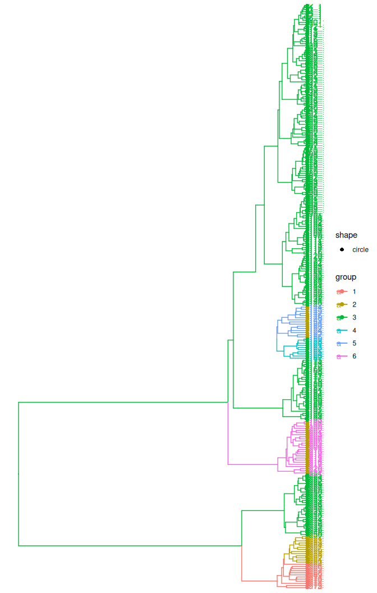
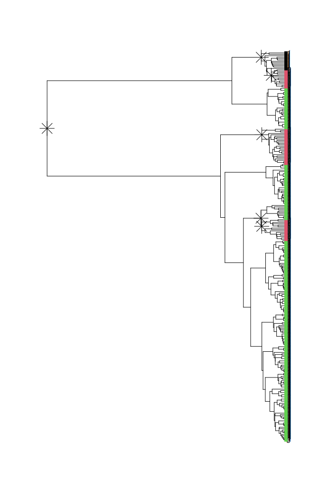
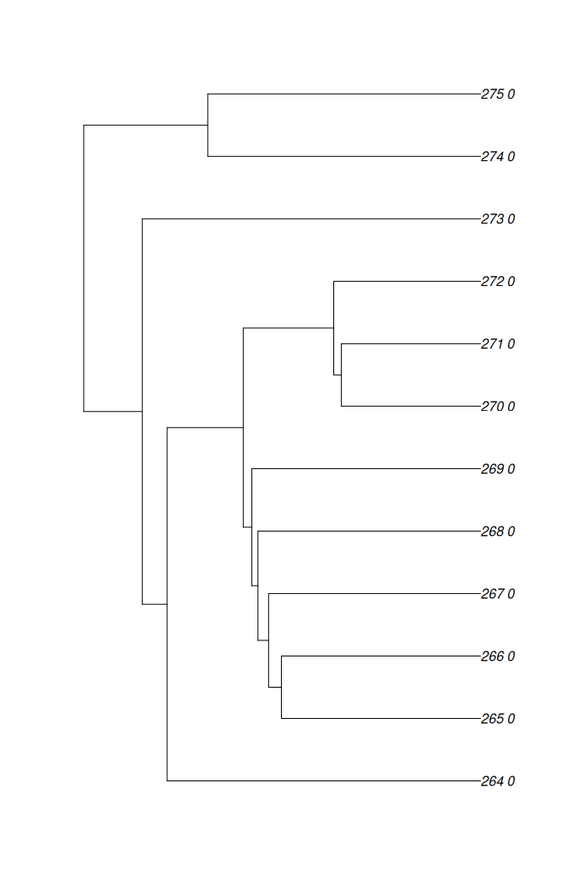

# treestructure applied to structured coalescent simulation

## Structured coalescent simulation

This example shows the function `trestruct` applied to a simulated
structured coalescent tree that includes samples from a large constant
size population and samples from three small “outbreaks” which are
growing exponentially. These simulations were generated with the
[phydynR package](https://emvolz-phylodynamics.github.io/phydynR/).

``` r
library(ape)
library(treestructure)
library(ggtree)
```

Load the tree:

``` r
( tree <- ape::read.tree( system.file('sim.nwk', package = 'treestructure') ) ) 
#> 
#> Phylogenetic tree with 275 tips and 274 internal nodes.
#> 
#> Tip labels:
#>   1, 1, 1, 1, 1, 1, ...
#> 
#> Rooted; includes branch length(s).
```

Note that the tip labels corresponds to the deme of each sample. ‘1’ is
the constant size reservoir, and ‘0’ is the exponentially growing deme.

This will run the `treestructure` algorithm under default setting:

``` r
s <- trestruct( tree ) 
#> Tree has NA or duplicated tip labels. Adding a unique id.
#> Finding splits under nodes: 276 
#> Finding splits under nodes: 276 526 
#> Finding splits under nodes: 276 421 
#> Finding splits under nodes: 276 473
```

The `treestructure` algorithm searches from root to tips of the
phylogenetic tree. The message printed in the screen
`Finding slipts under nodes` reports which nodes the algorithm is
currently doing the test on.

You can print the results:

``` r
print(s) 
#> Call: 
#> .trestruct(tre = tre, minCladeSize = minCladeSize, minOverlap = minOverlap, 
#>     nodeSupportValues = nodeSupportValues, nodeSupportThreshold = nodeSupportThreshold, 
#>     nsim = nsim, level = level[1], ncpu = ncpu, verbosity = verbosity, 
#>     debugLevel = debugLevel, useNodeSupport = useNodeSupport, 
#>     tredat = tredat)
#> 
#> Significance level: 0.01 
#> Number of clusters: 4 
#> Number of partitions: 2 
#> Number of taxa in each cluster:
#> 
#>   1   2   3   4 
#>  25  25 200  25 
#> Number of taxa in each partition:
#> 
#>   1   2 
#>  75 200 
#> ...
#> For complete data, use `as.data.frame(...)`
```

### Plotting results

The default plotting behavior uses the `ggtree` package if available.

``` r
plot(s)  + ggtree::geom_tiplab() 
```



If not, or if desired, `ape` plots are available

``` r
plot( s, use_ggtree = FALSE )
```



For subsequent analysis, you may want to turn the `treestructure` result
into a dataframe:

``` r
structureData <- as.data.frame( s ) 
head( structureData )
#>   taxon cluster partition
#> 1   1_1       3         2
#> 2   2_1       3         2
#> 3   3_1       3         2
#> 4   4_1       3         2
#> 5   5_1       3         2
#> 6   6_1       3         2
```

Each cluster and partition assignment is stored as a factor. You could
use `split` to get a data frame for each partition. Suppose we want a
tree corresponding to partition 1:

``` r
with ( structureData, 
       ape::keep.tip(s$tree, taxon[ partition==1 ] ) 
       ) -> partition1
partition1
#> 
#> Phylogenetic tree with 75 tips and 74 internal nodes.
#> 
#> Tip labels:
#>   143_0, 144_0, 145_0, 146_0, 147_0, 148_0, ...
#> 
#> Rooted; includes branch length(s).
plot(partition1)
```



### Parameter choice and number of clusters

Two parameters will have large influence on results:

1.  `level` is the significance level for subdividing a clade into a new
    cluster. To detect more clusters, increase `p`, but note that this
    will also increase the false positive rate.
2.  `minCladeSize` controls the smallest allowed cluster size in terms
    of the number of tips. With a smaller value, smaller clusters may be
    detected, but computation time will increase.

Example:

``` r
trestruct( tree, level = .05, minCladeSize = 5 )
#> Tree has NA or duplicated tip labels. Adding a unique id.
#> Finding splits under nodes: 276 
#> Finding splits under nodes: 276 526 
#> Finding splits under nodes: 276 421 
#> Finding splits under nodes: 276 473 
#> Finding splits under nodes: 276 359 
#> Finding splits under nodes: 276 277
#> Call: 
#> .trestruct(tre = tre, minCladeSize = minCladeSize, minOverlap = minOverlap, 
#>     nodeSupportValues = nodeSupportValues, nodeSupportThreshold = nodeSupportThreshold, 
#>     nsim = nsim, level = level[1], ncpu = ncpu, verbosity = verbosity, 
#>     debugLevel = debugLevel, useNodeSupport = useNodeSupport, 
#>     tredat = tredat)
#> 
#> Significance level: 0.05 
#> Number of clusters: 6 
#> Number of partitions: 2 
#> Number of taxa in each cluster:
#> 
#>   1   2   3   4   5   6 
#>  25  25  25   6  29 165 
#> Number of taxa in each partition:
#> 
#>   1   2 
#>  75 200 
#> ...
#> For complete data, use `as.data.frame(...)`
```

In practice, clustering thresholds are always subjective and the best
value of the `level` parameter will depend on your application. One way
to choose an appropriate `level` would be to use additional data
associated with each sample. You can select the `level` which gives a
set of clusters that explains the most variance in the data of interest
(e.g. use the cluster as a factor in an ANOVA).

#### CH index

Alternatively, in the absence of any additional data, the
`treestructure` package supports using the [CH
index](https://en.wikipedia.org/wiki/Calinski%E2%80%93Harabasz_index) to
compare different `level`s. This statistic is based on the ratio of the
between-cluster and within-cluster variance of the time of each node
(distance from the root) and returns the `level` such that this ratio is
maximized. If you wish to use the CH index, pass `level = NULL` to
`trestruct`, and read documentation for the `levellb`, `levelub`, and
`res` parameters.
