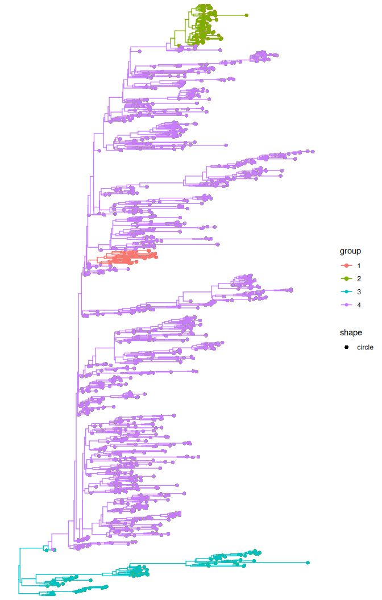
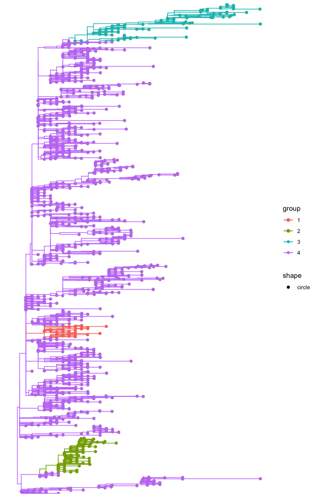

# Update of a treestructure object with new sequences

## Introduction

In this tutorial, we will exemplify how to update a previous
`treestructure` object with new sequences using a down sampled version
of the [Ebola dated
tree](https://github.com/ebov/space-time/blob/master/Data/Makona_1610_cds_ig.GLM.MCC.tree),
which is publicly available.

First, we will load all the R packages that we will use in this
tutorial.

``` r
library(ape)
library(treestructure)
library(phangorn)
```

Now we can read the down-sampled time-tree for Ebola. In this pruned
tree, we have 1,310 tips.

``` r
pruned_tree <- readRDS( system.file('Ebola_down_sampled_tree.rds',
                                    package='treestructure') )
```

### Assign clusters using node support

Now we will assign clusters using the posterior probability node support
to the Ebola down-sampled phylogenetic tree:

``` r
trestruct_res <- trestruct(pruned_tree, 
                           minCladeSize = 30, 
                           nodeSupportValues = TRUE, 
                           nodeSupportThreshold = 95,
                           level = 0.01)
```

In the above example, the `trestruct` function took 32 seconds to run on
a macOS M2. Here, we will load the results.

``` r
trestruct_res <- readRDS( system.file('downsampled_tree_struc.rds',
                                      package='treestructure') )

plot(trestruct_res, use_ggtree = T) + ggtree::geom_tippoint()
```



The `treestructure` analyses resulted in 4 clusters.

### Update a previous treestrucuture object with new sequences

To update the previous `treestructure` object with new sequences, we
will now use the maximum likelihood [Ebola
tree](https://github.com/ebov/space-time/blob/master/Data/Makona_1610_genomes_2016-06-23.ml.tree).

Note that this new tree must be rooted, but does not need to be
time-scaled or binary.

``` r
#Note that this tree has more sequences than the previous tree used in this
#tutorial.
new_tree <- ape::read.nexus( system.file('Makona_1610_genomes_2016-06-23.ml.tree',
                                         package='treestructure') )

#now we can root the tree using mid-point rooting for illustration
ml_rooted_tree <- phangorn::midpoint(new_tree)

#now we need to remove the quotes from the tip names (to avoid an error with 
#treestructure function)
ml_rooted_tree$tip.label <- unlist(lapply(ml_rooted_tree$tip.label, 
                                          function (x) gsub("'", "", x)))
```

And without the need to re-estimate a timetree or re-run `trestruct`
from scratch, we are now able to add the new sequences to the existing
`treestructure` object:

``` r
trestruct_add_tips <- addtips(trst = trestruct_res, tre = ml_rooted_tree)

plot(trestruct_add_tips, use_ggtree = T) + ggtree::geom_tippoint()
```



If you would like to compare the sequence names that comprise each
cluster in each tree, you can do:

``` r

#compare sequences in cluster 1 from trestruct_res object and the 
#trestruct_add_tips object

tree1_cluster1 <- trestruct_res$clusterSets$`1`
tree2_cluster1 <- trestruct_add_tips$clusterSets$`1`

length(tree1_cluster1)
#> [1] 30
length(tree2_cluster1)
#> [1] 41
```

Note that the length of tree1_cluster1 and tree2_cluster1 is different.
That is because we *added* tips from the ML tree, *ml_rooted_tree*, to
the `treestructure` object, *trestruct_res*.

You can also see that all elements in tree1_cluster1 is contained in
tree2_cluster1

``` r

sum(tree1_cluster1 %in% tree2_cluster1)
#> [1] 30
```
